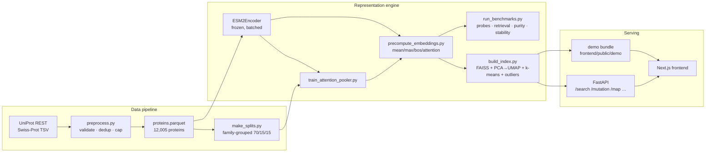
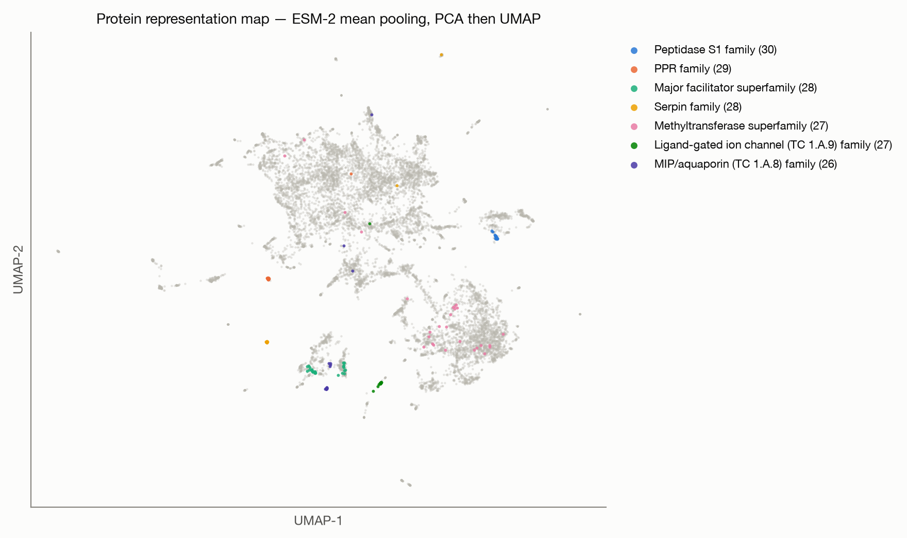
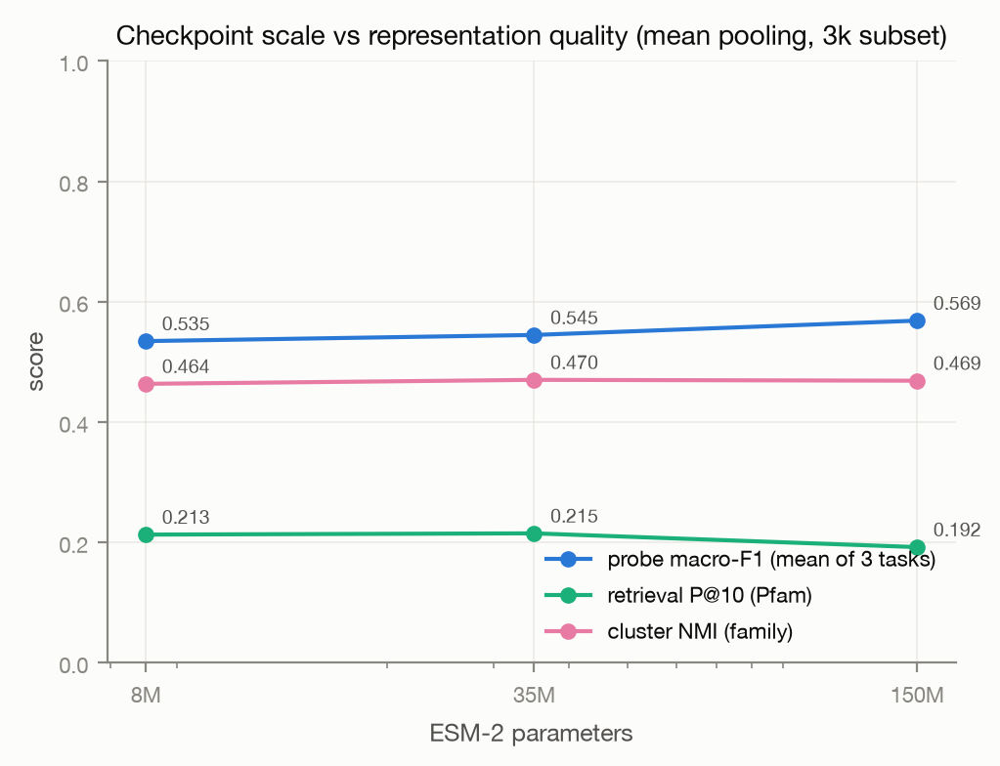

# ProteinLens

An interactive representation-learning platform for exploring the learned geometry of protein
sequence space. A frozen [ESM-2](https://github.com/facebookresearch/esm) protein language model
embeds a real Swiss-Prot corpus; ProteinLens turns those representations into semantic retrieval,
mutation perturbation analysis, interpretability views, and a rigorously benchmarked, interactive
map of protein space.

ProteinLens analyzes how pretrained protein representations organize sequence and functional
metadata. It deliberately makes **no** biological discovery claims — see
[Scientific framing](#scientific-framing).

## Overview

```text
Protein sequence (UniProtKB/Swiss-Prot, 9 organisms, ~12k proteins)
      ↓
ESM-2 tokenizer → frozen transformer (facebook/esm2_t12_35M_UR50D)
      ↓
Residue-level representations  (special tokens stripped)
      ↓
Pooling: mean · max · BOS · learned additive attention
      ↓
Protein-level embedding  (480-d, cached, versioned)
      ↓
┌────────────────┬─────────────────────┬────────────────────┐
│ FAISS retrieval│ Mutation analysis   │ Probes & benchmarks│
│ (exact cosine) │ Δz = z_mut − z_wt   │ (frozen encoder)   │
└────────────────┴─────────────────────┴────────────────────┘
      ↓
PCA(50) → UMAP(2) → interactive representation map (Next.js)
```

## Demo

**Live demo: [sunkalpchandra.github.io/proteinlens](https://sunkalpchandra.github.io/proteinlens/)**
(static export on GitHub Pages, auto-deployed from `main`).

- **Frontend**: Next.js app with a canvas-rendered embedding map (12k points, 60 fps zoom/pan),
  protein profiles, semantic search, and a mutation simulator.
- **Static demo mode**: the deployed site runs entirely from a precomputed 1,200-protein bundle —
  browsing, retrieval, attention views, and showcase mutation landscapes need **no backend**.
- **Live mode**: point `NEXT_PUBLIC_API_URL` at the FastAPI server and every feature works on
  arbitrary sequences (ESM inference server-side).

The signature workflow: search *hemoglobin* → open the protein → the map highlights its
representation-space neighbors → click residue 63 → compute the 19-substitution mutation
landscape → inspect which substitutions perturb the representation most.

## Architecture



## ML method

**Encoder.** `facebook/esm2_t12_35M_UR50D` (12 layers, 480-d, ~35M parameters), always frozen.
Residue representations exclude BOS/EOS/padding via the tokenizer's special-token mask, so
representation *i* corresponds to residue *i* — verified at runtime. Batches pack sequences under
a token budget after length sorting to minimize padding waste.

**Pooling.** Four strategies over residue matrix `H ∈ R^{L×D}`:

```text
mean:       z = (1/L) Σᵢ hᵢ
max:        z_d = maxᵢ h_{i,d}
bos:        z = h_BOS
attention:  αᵢ = softmax(w₂ᵀ tanh(W₁hᵢ + b₁)),   z = Σᵢ αᵢ hᵢ
```

The attention pooler is the only learned component: trained jointly with a linear classifier on
UniProt family labels (train split only, encoder frozen), then reused corpus-wide. Its weights
`αᵢ` double as a model-dependent interpretability signal.

**Retrieval.** Embeddings are L2-normalized so cosine similarity equals inner product. Three
index backends sit behind one interface — exact `flat` (default up to 50k vectors), `hnsw`, and
`ivf` — with `auto_backend` switching by corpus size. Measured on this host
(`reports/ann_benchmark.md`): at 150k vectors HNSW answers at **2.6× the QPS of exact search with
0.9995 recall@10**; at 12k, exact search already runs at ~11k QPS and stays the default.

```text
sim(zᵢ, zⱼ) = (zᵢ · zⱼ) / (‖zᵢ‖ ‖zⱼ‖)
```

**Map.** PCA to 50 components, then UMAP to 2D (cosine metric, fixed seed). UMAP never runs on
raw 480-d vectors, and every parameter set is cached under a content hash.

**Mutation analysis.** For substitution `X{pos}Y`, both sequences are re-encoded and compared:

```text
Δz = z_mut − z_wt          ‖Δz‖₂, cos(z_wt, z_mut)
per-residue: ‖Δhᵢ‖₂        local window ±8 around the site
```

Displayed strictly as **representation-space perturbation** — not fitness, stability, or
pathogenicity. The landscape view computes all 19 substitutions at a site in one batched pass.

**Clustering & outliers.** Two lenses: k-means (k=25) partitions the whole corpus, and HDBSCAN
(leaf selection, PCA-50 space) reports *density islands* — on this corpus, 47 tight islands with
~90% of proteins on one connected low-density manifold, which HDBSCAN honestly labels noise.
(Density-based clustering collapses in raw 480-d space; the PCA-50 reduction and the finding are
recorded in the artifact.) Outlier score is the percentile of mean cosine distance to the 10
nearest neighbors — a geometric isolation statement, not a biological anomaly claim.

## Data

| | |
|---|---|
| Source | UniProtKB/Swiss-Prot (reviewed), REST stream API, release recorded in manifest |
| License | [CC BY 4.0](https://www.uniprot.org/help/license) |
| Organisms | human, mouse, zebrafish, fly, worm, arabidopsis, yeast, *E. coli* K-12, *B. subtilis* |
| Filters | length 50–512, canonical alphabet only, exact-duplicate removal, uncharacterized entries dropped |
| Corpus | 12,005 proteins, 94.5% with Pfam domains, ~3.2k family labels |
| Sampling | ≤80 proteins per family (anti-dominance), then organism-proportional to 12k, seed 42 |

Raw downloads land in `data/raw/` with a manifest (queries, UniProt release, SHA-256 per file).
Nothing under `data/` is committed; `scripts/download_data.py` reproduces it.

## Splits (leakage control)

Random splits let homologs straddle train/test and turn probe metrics into homology detection.
ProteinLens builds groups as **connected components of a union-find over annotation tokens**:
each protein links its UniProt family label with *all* of its Pfam domains, so proteins sharing a
domain share a group even when only one carries a family annotation (a tiered fallback would leak
exactly those pairs — caught by this project's own adversarial review and fixed). Unannotated
proteins join their most k-mer-similar annotated group at Jaccard ≥ 0.5, else form their own
clusters. Whole groups are assigned to train/val/test (70/15/15), and a leakage audit compares
cross-split k-mer similarity against a within-train reference (numbers in
`data/processed/splits.json`). Residual risk (remote homology with no shared annotation) is
documented in [Limitations](#limitations).

Because families *are* the grouping unit, probe tasks target labels that cut across families
(enzyme/non-enzyme, EC top class, subcellular localization) — a genuine generalization test, not
family memorization.

**Validation against identity clustering.** `make_splits --method mmseqs` groups by MMseqs2
clusters (30% identity, 80% coverage) instead. The comparison
(`reports/split_methods.md`) is decisive: on 200,000 random pairs, **zero** pairs are joined by
identity clustering but separated by the annotation grouping — annotation union-find is strictly
more conservative (it additionally joins ~6k pairs that <30% identity cannot see). Probe metrics
under MMseqs splits come out *higher* (e.g. EC class accuracy 0.70 vs 0.47), consistent with the
looser grouping readmitting homology — the annotation-grouped numbers reported here are the
harder, honest ones.

## Installation

```bash
git clone https://github.com/sunkalpchandra/proteinlens
cd proteinlens
make venv install          # Python 3.11+; installs torch, transformers, faiss, …
```

macOS arm64 note: torch and faiss-cpu each vendor a libomp; loading both segfaults. `make install`
runs `scripts/fix_macos_libomp.sh`, which points FAISS at torch's copy.

## Quickstart

```bash
# Full pipeline (download → preprocess → splits → pooler → embeddings → index → demo bundle)
make setup

# Or step by step:
python scripts/download_data.py            # ~15 MB from UniProt
python scripts/preprocess.py               # → data/processed/proteins.parquet
python scripts/make_splits.py              # → leakage-audited splits
python scripts/train_attention_pooler.py   # ~15 min on Apple Silicon / GPU
python scripts/precompute_embeddings.py    # ~30 min on MPS, one pass, 4 poolings
python scripts/build_index.py              # FAISS + UMAP + clusters + outliers
python scripts/run_benchmarks.py           # full evaluation suite
python scripts/generate_figures.py         # reports/figures/*.png|pdf

# Optional add-ons
python scripts/download_domains.py         # UniProt DOMAIN coordinates (region views)
make extended                              # checkpoint scaling + SupCon + ProstT5 studies
make ann-benchmark                         # index backends to 150k vectors

# Serve
uvicorn api.main:app --reload              # backend on :8000
cd frontend && npm install && NEXT_PUBLIC_API_URL=http://localhost:8000 npm run dev
```

Environment knobs: `PROTEINLENS_MODEL` (any ESM-2 checkpoint), `PROTEINLENS_DEVICE`
(cuda/mps/cpu), `PROTEINLENS_CORS_ORIGINS`. See `.env.example`.

## Embedding pipeline

- **Cache keys**: `sha256(model | pooling | version | sequence)` in a SQLite vector cache —
  ad-hoc requests (pasted sequences, mutants) never recompute. Corpus embeddings live in
  consolidated `.npy` matrices, one per pooling, memory-mapped at serve time.
- **Versioning**: `embedding_version` invalidates caches when representation semantics change.
- **Residue-level**: computed on demand with an in-process LRU (mutation landscapes hit the same
  wild-type repeatedly).

## API

`GET /health` · `GET /stats` · `POST /embed` · `POST /search` · `POST /region-search` ·
`POST /compare` · `GET /proteins?q=` · `GET /protein/{id}` · `GET /protein/{id}/attention` ·
`GET /protein/{id}/domains` · `POST /mutation` · `POST /mutation-landscape` ·
`POST /trajectory` · `GET /map?preset=default|local|global` · `GET /clusters` ·
`GET /benchmark`

Pydantic schemas validate everything; invalid amino-acid symbols return a clean 422 with the
offending characters named. Missing artifacts return 503 with the script to run. No filesystem
paths are exposed.

## Benchmarking

Four representation families × four evaluation axes, regenerated end-to-end by
`scripts/run_benchmarks.py` (nothing hand-entered):

| Axis | Metric | Question |
|---|---|---|
| Probes | accuracy, macro-F1, AUROC | Is function linearly accessible from frozen embeddings? |
| Retrieval | precision@1/5/10 (Pfam, family) | Do nearest neighbors share annotations? |
| Clustering | purity, NMI vs family | Does unsupervised structure recover annotations? |
| Stability | cos(z, z′) under 1 substitution | How smooth is the representation? |

Baselines: 3-mer frequency vectors (8000-d) and mean one-hot composition (20-d) — the bar any
learned representation must clear.

## Results



<!-- RESULTS:BEGIN — filled by scripts/run_benchmarks.py output; see reports/benchmark.md -->
Headline numbers from the last full run (`reports/benchmark.csv`; regenerate with
`python scripts/run_benchmarks.py`). Probes use leakage-aware family-grouped splits.

| Representation | Probe macro-F1 (mean of 3 tasks) | Retrieval P@10 (Pfam) | Cluster NMI (family) | Stability cos (1 sub) |
|---|---|---|---|---|
| 3-mer frequencies (baseline) | 0.337 | 0.190 | 0.390 | 0.9884 |
| one-hot composition (baseline) | 0.331 | 0.106 | 0.428 | 0.9997 |
| ESM-2 mean pooling | 0.528 | 0.350 | 0.467 | 0.9961 |
| ESM-2 max pooling | 0.495 | 0.430 | 0.478 | 0.9973 |
| ESM-2 BOS token | 0.493 | 0.255 | 0.440 | 0.9963 |
| ESM-2 attention pooling (learned) | 0.447 | 0.337 | 0.457 | 0.9808 |

Full per-task tables: [`reports/benchmark.md`](reports/benchmark.md).
<!-- RESULTS:END -->

Figures in `reports/figures/` (regenerate with `python scripts/generate_figures.py`): global map,
sequence-vs-embedding similarity, mutation displacement heatmap, retrieval precision@k, probe
results, pooling comparison, clusters, outliers.

## Reproducibility

- Deterministic seeds everywhere (download → sampling → splits → UMAP → benchmarks).
- `experiments/` records every run: config, metrics, timestamp, git commit.
- Data manifests pin the UniProt release and file hashes.
- `make setup` rebuilds the entire pipeline from a clean clone.

## Project structure

```text
proteinlens/
├── models/            # encoder.py (frozen ESM-2) · pooling.py · mutation.py
│                      # registry.py (checkpoints) · prost_encoder.py (ProstT5)
├── ml/                # embeddings, retrieval (flat/HNSW/IVF), projection+presets,
│                      # clustering, splitting (annotation/MMseqs2), probes,
│                      # evaluation, losses (SupCon), regions, corpus, tracking
├── api/               # FastAPI app: schemas, state, routes/
├── scripts/           # download → preprocess → splits → pooler → embed →
│                      # index → benchmarks → figures → demo bundle
├── data/              # raw/ processed/ embeddings/ index/   (never committed)
├── experiments/       # one JSON per run
├── reports/           # benchmark.md/csv + figures/
├── tests/             # ML unit tests + API contract tests
└── frontend/          # Next.js 15 + TS + Tailwind: explorer, search,
                       # protein/[id], mutation, benchmarks, about
```

## Scientific framing

- Embedding similarity is called **representation similarity**; unusually similar low-identity
  pairs are **representation-space neighbors** — no convergent-evolution claims.
- Mutation effects are **representation-space perturbations** — no fitness or pathogenicity
  prediction exists in this codebase.
- Attention weights are a **model-dependent interpretability signal**, not functional-residue
  annotations.
- Outliers are **geometrically isolated in the selected representation space**, nothing more.

## Limitations

- 35M-parameter encoder: representation quality is well below ESM-2 650M/3B; the config accepts
  larger checkpoints if you have the memory.
- Family/Pfam grouping controls the dominant leakage mode but cannot eliminate remote homology
  across families; the k-mer audit bounds only what k-mers can see.
- UMAP distorts global distances; the map is for structure browsing, not distance measurement.
- Annotation sparsity: ~24% of the corpus has no family label; localization labels are coarse.
- Attention pooling was trained on family classification; its weights reflect that objective.
- No structural (3D) information is used anywhere.

## Extended studies

Beyond the core benchmark, the repo carries four comparative studies on a shared, stratified
~3k-protein evaluation subset (`make extended` reproduces all of them):

- **Checkpoint scaling** — ESM-2 8M / 35M / 150M through one registry-driven interface
  (`models/registry.py`), with per-checkpoint token budgets sized by attention memory.
- **Pooling objectives** — the attention pooler trained with cross-entropy vs supervised
  contrastive loss (SupCon optimizes the cosine geometry retrieval actually uses; early stopping
  on holdout 1-NN accuracy).
- **Structure-aware reference** — the ProstT5 encoder (3Di-supervised, ~1.2B params, fp16) as a
  representation baseline, labeled as a reference point rather than a like-for-like comparison.
- **Index scaling** — flat/HNSW/IVF backends benchmarked to 150k vectors
  (`reports/ann_benchmark.md`), with automatic backend selection at 50k.

Results land in `reports/extended_benchmark.{csv,md}` and figures 09–10; the benchmarks page
renders them when present.



<!-- EXTENDED:BEGIN -->
Headline extended numbers (subset probes use the same leakage-aware splits):

| representation | group | params (M) | probe F1 (mean) | P@1 (Pfam) | NMI |
|---|---|---|---|---|---|
| kmer3 | baseline | 0 | 0.319 | 0.399 | 0.437 |
| onehot | baseline | 0 | 0.368 | 0.215 | 0.455 |
| esm2-8M-bos | esm2-scaling | 8 | 0.476 | 0.416 | 0.473 |
| esm2-8M-max | esm2-scaling | 8 | 0.452 | 0.658 | 0.477 |
| esm2-8M-mean | esm2-scaling | 8 | 0.535 | 0.591 | 0.464 |
| esm2-35M-bos | esm2-scaling | 35 | 0.499 | 0.497 | 0.455 |
| esm2-35M-max | esm2-scaling | 35 | 0.479 | 0.778 | 0.474 |
| esm2-35M-mean | esm2-scaling | 35 | 0.545 | 0.648 | 0.470 |
| esm2-150M-bos | esm2-scaling | 150 | 0.547 | 0.550 | 0.469 |
| esm2-150M-max | esm2-scaling | 150 | 0.513 | 0.805 | 0.455 |
| esm2-150M-mean | esm2-scaling | 150 | 0.569 | 0.635 | 0.469 |
| esm2-35M-attention | pooling-objective | 35 | 0.463 | 0.611 | 0.480 |
| esm2-35M-attention-supcon | pooling-objective | 35 | 0.520 | 0.769 | 0.488 |
| prostt5-mean | structure-aware | 1208 | 0.551 | 0.773 | 0.487 |

Full tables: [`reports/extended_benchmark.md`](reports/extended_benchmark.md).
<!-- EXTENDED:END --> Per-domain views run on 5,204 UniProt-curated DOMAIN coordinates:
`GET /protein/{id}/domains` and `POST /region-search` embed an arbitrary residue span and query
the corpus with it.

## Future work

InterPro-backed domain coordinates for full corpus coverage · product-quantized indexes past 1M
vectors · ESM-C / larger checkpoints on GPU hosts · validating representation displacement
against deep mutational scanning data · multi-checkpoint serving behind one API.

## License

MIT for the code (see `LICENSE`). Protein data © UniProt Consortium, CC BY 4.0.
